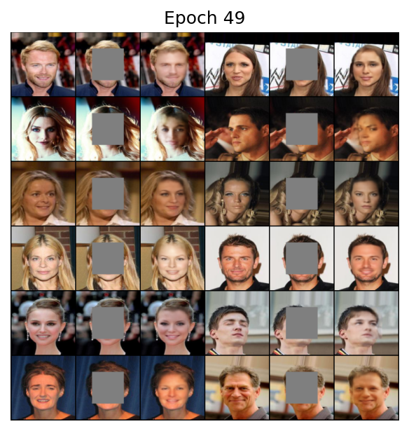

# Context-Encoder

> Pathak, Deepak, Philipp Krahenbuhl, Jeff Donahue, Trevor Darrell, and Alexei A. Efros. "Context encoders: Feature learning by inpainting." In Proceedings of the IEEE conference on computer vision and pattern recognition, pp. 2536-2544. 2016.


## Training

1. Download dataset

2. Modify the configuration file `config.yml`

   - Set `dataroot` to where you save the dataset, and `mask_root` to where you save the mask images.
   - Set hyperparameters such as `lr`, `betas`, `batch_size`, etc.

3. Run command:

   ```shell
   python main.py --mode train
   ```

4. The result will be saved to `runs/exp_name/` where `exp_name` is set in `config.yml`.


## Evaluation

1. Run command:

   ```shell
   python main.py --mode evaluate --model_path MODEL_PATH --dataset DATASET --dataroot DATAROOT --mask_root MASK_ROOT
   ```

   Arguments:

   - `MODEL_PATH`: path to the saved model
   - `DATASET`: choose a dataset to evaluate on, e.g., `celeba`
   - `DATAROOT`: path to downloaded dataset
   - `MASK_ROOT`: path to the directory that contains mask images


## Prediction

1. Put images to be inpainted under a directory

2. Run command:

   ```shell
   python main.py --mode predict --model_path MODEL_PATH --predict_dir PREDICT_DIR
   ```

   Arguments:

   - `MODEL_PATH`: path to the saved model
   - `PREDICT_DIR`: directory containing images to be inpainted

3. Result will be saved to `PREDICT_DIR/fake/`


## Results


|                  | MSE                  | PSNR               | SSIM               |
| ---------------- | -------------------- | ------------------ | ------------------ |
| CelebA           | 0.027239598231565788 | 16.30733189297244  | 0.5808343275468552 |
| CelebA (L2 only) | 0.013666485626169927 | 19.464009678979853 | 0.6867653778366474 |


### CelebA

| L2+adv                                               | L2 only                                                    |
| ---------------------------------------------------- | ---------------------------------------------------------- |
|  |  |

Though "L2 only" got higher PSNR and SSIM score, it is visually more blurry than  "L2+adv".

