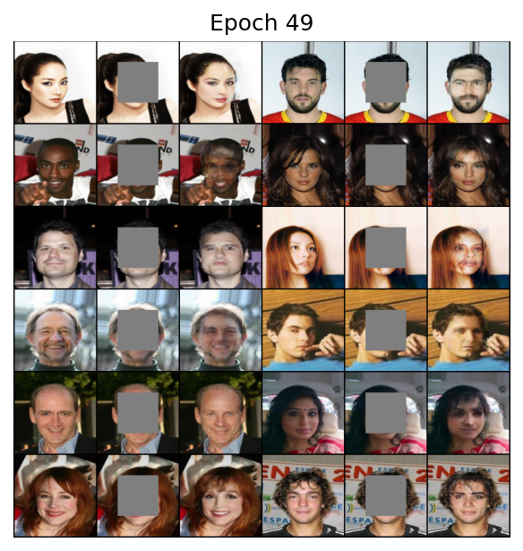

# Context-Encoder

> Pathak, Deepak, Philipp Krahenbuhl, Jeff Donahue, Trevor Darrell, and Alexei A. Efros. "Context encoders: Feature learning by inpainting." In Proceedings of the IEEE conference on computer vision and pattern recognition, pp. 2536-2544. 2016.

## Results

### CelebA

