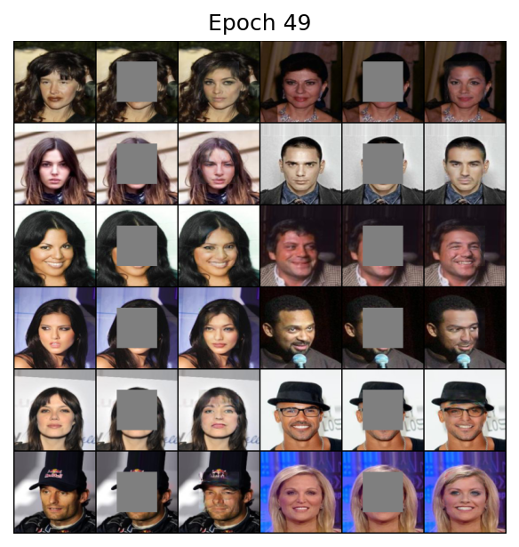

# Context-Encoder

> Pathak, Deepak, Philipp Krahenbuhl, Jeff Donahue, Trevor Darrell, and Alexei A. Efros. "Context encoders: Feature learning by inpainting." In Proceedings of the IEEE conference on computer vision and pattern recognition, pp. 2536-2544. 2016.


## Training

1. Download dataset

2. Modify the configuration file `config.yml`

   - Set `dataroot` to where you save the dataset, and `mask_root` to where you save the mask images.
   - Set hyperparameters such as `lr`, `betas`, `batch_size`, etc.

3. Run command:

   ```shell
   python main.py --mode train
   ```

4. The result will be saved to `runs/exp_name/`.


## Evaluate

Run command:

```shell
python main.py --mode evaluate --model_path MODEL_PATH --dataset DATASET --dataroot DATAROOT --mask_root MASK_ROOT
```


## Predict

1. Put images to be inpainted under a directory

2. Run command:

   ```shell
   python main.py --mode predict --model_path MODEL_PATH --predict_dir PREDICT_DIR
   ```

3. Result will be saved to `PREDICT_DIR/fake/`


## Results


| dataset | MSE                  | PSNR              | SSIM               |
| ------- | -------------------- | ----------------- | ------------------ |
| CelebA  | 0.027239598231565788 | 16.30733189297244 | 0.5808343275468552 |


### CelebA



