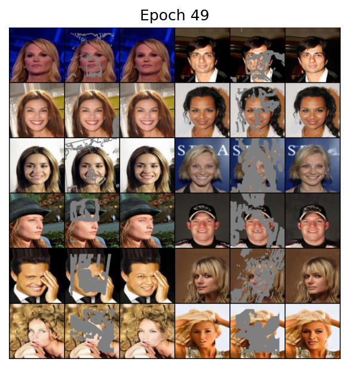

# Partial-Conv

> Liu, Guilin, Fitsum A. Reda, Kevin J. Shih, Ting-Chun Wang, Andrew Tao, and Bryan Catanzaro. "Image inpainting for irregular holes using partial convolutions." In *Proceedings of the European conference on computer vision (ECCV)*, pp. 85-100. 2018.

:small_orange_diamond: For simplicity (and my laziness), I skipped the fine-tuning process as stated in the original paper.

:small_orange_diamond: I didn't replace the pixels outside the masked area in the output image with ground-truth.

:small_red_triangle: Theoretically, result of Partial-Conv should not be affected by pixels in masked area. However, as I change those pixels, the result changes too. I wonder if it's due to bugs in my code.


## Training

1. Download dataset

2. Modify the configuration file `config.yml`

   | Parameter                                                    | Description                                                  |
   | ------------------------------------------------------------ | ------------------------------------------------------------ |
   | `use_gpu`                                                    | Use GPU or CPU. Default: `true`.                             |
   | `exp_name`                                                   | Name of current experiment. If None (`~`), will be replaced by running time.<br/>Results will be saved to `./runs/{exp_name}`. |
   | `dataset`                                                    | Dataset to use. Options: `celeba`.                           |
   | `dataroot`                                                   | Path to pre-downloaded dataset.                              |
   | `mask_root`                                                  | Path to pre-downloaded mask images.                          |
   | `epochs`                                                     | Training epochs.                                             |
   | `batch_size`                                                 | Batch size.                                                  |
   | `lambda_valid`<br/>`lambda_hole`<br/>`lambda_perceptual`<br/>`lambda_style`<br/>`lambda_tv` | Coefficients of five losses.                                 |
   | `adam`                                                       | Optimizer configurations.                                    |
   | `sample_per_epochs`                                          | Interval for sampling the generator.                         |
   | `save_per_epochs`                                            | Interval for saving checkpoints.                             |

3. Run command:

   ```shell
   python main.py --mode train
   ```

4. The result will be saved to `runs/exp_name/` where `exp_name` is set in `config.yml`.


## Evaluation

1. Run command:

   ```shell
   python main.py --mode evaluate --model_path MODEL_PATH --dataset DATASET --dataroot DATAROOT --mask_root MASK_ROOT
   ```

   Arguments:

   - `MODEL_PATH`: path to the saved model
   - `DATASET`: dataset to evaluate on. Options: `celeba`
   - `DATAROOT`: path to pre-downloaded dataset
   - `MASK_ROOT`: path to pre-downloaded mask images


## Prediction

1. Create a directory `PREDICT_DIR`, put images to be inpainted under `PREDICT_DIR/img/`, put corresponding masks under `PREDICT_DIR/mask/`. Note that the file name of an input image and its mask should be the same.

2. Run command:

   ```shell
   python main.py --mode predict --model_path MODEL_PATH --predict_dir PREDICT_DIR
   ```

   Arguments:

   - `MODEL_PATH`: path to the saved model
   - `PREDICT_DIR`: directory containing images to be inpainted

3. Result will be saved to `PREDICT_DIR/fake/`


## Results

|        | MSE                  | PSNR              | SSIM               |
| ------ | -------------------- | ----------------- | ------------------ |
| CelebA | 0.003286094502756362 | 26.87414924543685 | 0.8951046452868284 |


### CelebA



