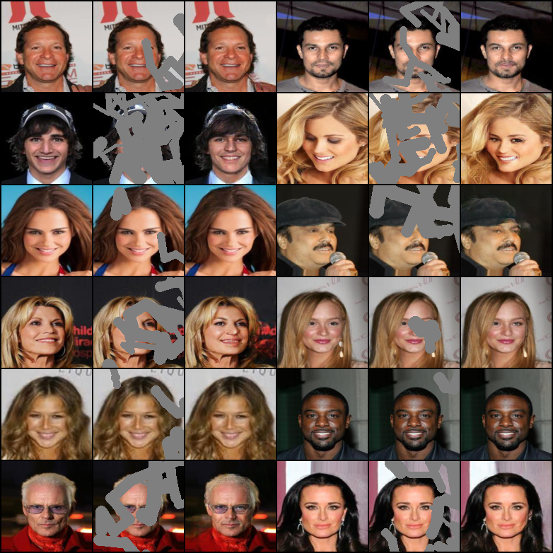

# Partial-Conv

> Liu, Guilin, Fitsum A. Reda, Kevin J. Shih, Ting-Chun Wang, Andrew Tao, and Bryan Catanzaro. "Image inpainting for irregular holes using partial convolutions." In *Proceedings of the European conference on computer vision (ECCV)*, pp. 85-100. 2018.

:small_orange_diamond: For simplicity (and my laziness), I skipped the fine-tuning process as stated in the original paper.

:small_orange_diamond: During training, pixels outside the masked area in the output image is not replaced by the ground-truth. However, they are replaced when evaluating or predicting.


## Training

1. Download dataset

2. Modify the configuration file `config.yml`

   | Arguments                                                    | Descriptions                                                 |
   | ------------------------------------------------------------ | ------------------------------------------------------------ |
   | `use_gpu`                                                    | Use GPU or CPU. Default: `true`.                             |
   | `dataset`                                                    | Dataset to use. Options: `celeba`.                           |
   | `dataroot`                                                   | Path to pre-downloaded dataset.                              |
   | `mask_type`                                                  | Type of mask. Options: `center`, `rectangles`, `brushes` or path to pre-downloaded mask images. |
   | `img_size`                                                   | Size of the input images.                                    |
   | `n_layer`                                                    | Number of layers in generator. Make sure that `2**n_layer <= img_size` |
   | `epochs`                                                     | Training epochs.                                             |
   | `batch_size`                                                 | Batch size.                                                  |
   | `lambda_valid`<br/>`lambda_hole`<br/>`lambda_perceptual`<br/>`lambda_style`<br/>`lambda_tv` | Coefficients of five losses.                                 |
   | `adam`                                                       | Optimizer configurations.                                    |
   | `sample_per_epochs`                                          | Interval for sampling the generator.                         |
   | `save_per_epochs`                                            | Interval for saving checkpoints.                             |
   
3. Run command:

   ```shell
   python train.py [--config_path CONFIG_PATH]
   ```

   Default `config_path` is `./config.yml`.

4. The result will be saved to `./runs/{current_time}/`.


## Evaluation

Run command:

```shell
python evaluate.py --model_path MODEL_PATH [--img_size IMG_SIZE] [--img_channels IMG_CHANNELS] [--n_layer N_LAYER] --dataset {celeba} --dataroot DATAROOT --mask_type MASK_TYPE [--batch_size BATCH_SIZE] [--cpu]
```

Arguments:

- `model_path`: path to the saved model
- `img_size`: size of the input images, default 128
- `img_channels`: number of channels of the input images, default 3
- `n_layer`: number of layers in generator, default 7
- `dataset`: dataset to evaluate on. Options: `celeba`
- `dataroot`: path to pre-downloaded dataset
- `mask_type`: a string of {'center', 'rectangles', 'brushes'} or path to pre-downloaded mask images
- `batch_size`: batch size, default 128


## Prediction

1. Create a directory `PREDICT_DIR`, put images to be inpainted under `PREDICT_DIR/img/`, put corresponding masks under `PREDICT_DIR/mask/`. Note that the file name of an input image and its mask should be the same.

2. Run command:

   ```shell
   python predict.py --model_path MODEL_PATH [--img_size IMG_SIZE] [--img_channels IMG_CHANNELS] [--n_layer N_LAYER] --predict_dir PREDICT_DIR [--cpu]
   ```
   
   Arguments:
   
   - `model_path`: path to the saved model
   - `img_size`: size of the input images, default 128
   - `img_channels`: number of channels of the input images, default 3
   - `n_layer`: number of layers in generator, default 7
   - `predict_dir`: directory containing images to be inpainted
   
3. Result will be saved to `PREDICT_DIR/fake/`.


## Results

|            |         MSE          |       PSNR       |        SSIM        |
| ---------- | :------------------: | :--------------: | :----------------: |
| celeba-128 | 0.003472036657023335 | 27.2345332661083 | 0.9115044737062835 |

Note: The results are calculated on the composited output, i.e., pixels outside the masked area are replaced by the ground-truth.


### CelebA (128x128)



